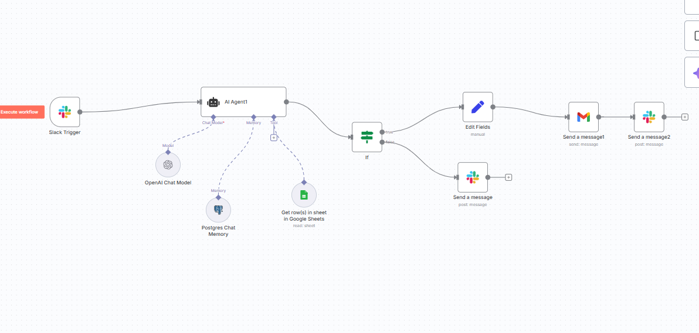

# Companies Research & Analysis System

A comprehensive AI-powered system for discovering, researching, and analyzing defense companies for strategic partnerships and business development opportunities.

## 🚀 Overview

This system combines advanced AI agents with RAG (Retrieval-Augmented Generation) technology to:
- **Discover** defense companies worldwide
- **Research** detailed company profiles and capabilities
- **Analyze** strategic partnership potential
- **Generate** comprehensive business intelligence reports

## 📁 Project Structure

```
Business Development/
├── agents.py                    # AI agents for company discovery and research
├── rag.py                      # RAG system for partnership analysis
├── README.md                   # This file
├── requirements.txt            # Python dependencies
├── defense_companies_research.csv    # Output: Discovered companies
├── analyzed_companies.csv      # Output: Partnership analysis results
└── collab_rag_db/             # Vector database for RAG system
```

## 🛠️ Features

### 1. **Intelligent Company Discovery** (`agents.py`)
- **Multi-Agent System**: Uses specialized AI agents for discovery and research
- **Targeted Search**: Finds companies based on specific criteria (type, location, count)
- **Duplicate Prevention**: Advanced duplicate detection and management
- **Rate Limiting**: Built-in API rate limiting to avoid service disruptions
- **Progress Tracking**: Real-time progress monitoring and status updates

### 2. **Comprehensive Research** (`agents.py`)
- **Deep Analysis**: Generates detailed company profiles with:
  - Company overview and history
  - Leadership and expertise
  - Defense projects and solutions
  - Market position and recent developments
  - Contact information and online presence
- **Structured Data**: Outputs organized CSV files with separate columns
- **Quality Control**: Ensures research completeness and accuracy

### 3. **Strategic Partnership Analysis** (`rag.py`)
- **RAG-Powered Analysis**: Uses Retrieval-Augmented Generation for intelligent insights
- **Partnership Viability Assessment**: High/Medium/Low scoring system
- **Capability Synergy Analysis**: Technology stack and market alignment
- **Strategic Opportunities**: Joint development, market expansion, technology integration
- **Risk Mitigation**: Identifies challenges and mitigation strategies
- **Actionable Recommendations**: Next steps and success metrics

## 🚀 Quick Start

### Prerequisites

1. **Python 3.8+** installed
2. **API Keys** for:
   - Groq API (for LLM)
   - Tavily API (for web search)

### Installation

1. **Clone the repository**:
   ```bash
   git clone <your-repo-url>
   cd "Business Development"
   ```

2. **Install dependencies**:
   ```bash
   pip install -r requirements.txt
   ```

3. **Set up environment variables**:
   ```bash
   # Windows PowerShell
   $env:GROQ_API_KEY="your_groq_api_key_here"
   $env:TAVILY_API_KEY="your_tavily_api_key_here"
   
   # Or create a .env file
   echo "GROQ_API_KEY=your_groq_api_key_here" > .env
   echo "TAVILY_API_KEY=your_tavily_api_key_here" >> .env
   ```

### Usage

#### 1. Discover and Research Companies

```python
# Run the company discovery and research system
python agents.py
```

**Interactive Configuration**:
- Choose company type (e.g., "Defense software companies")
- Select location (e.g., "India", "United States", "Global")
- Set target count (1-10 companies recommended)

**Output**: `defense_companies_research.csv` with detailed company profiles

#### 2. Analyze Partnership Potential

```python
# Run the RAG analysis system
python rag.py
```

**Input**: Uses the CSV file from step 1
**Output**: `analyzed_companies.csv` with strategic partnership analysis

## 📊 Output Files

### 1. `defense_companies_research.csv`
Contains discovered companies with columns:
- **Company_Name**: Company name
- **Location**: City, country
- **Website**: Official website URL
- **Services**: Brief service description
- **Detailed_Report**: Comprehensive company analysis

### 2. `analyzed_companies.csv`
Contains partnership analysis with additional column:
- **Strategic_Partnership_Analysis**: Detailed partnership assessment including:
  - Partnership viability score
  - Capability synergy analysis
  - Strategic opportunities
  - Risk mitigation strategies
  - Actionable recommendations

## 🔧 Configuration

### API Keys Setup

1. **Groq API**:
   - Sign up at [console.groq.com](https://console.groq.com)
   - Get your API key from settings
   - Set as environment variable: `GROQ_API_KEY`

2. **Tavily API**:
   - Sign up at [tavily.com](https://tavily.com)
   - Get your API key
   - Set as environment variable: `TAVILY_API_KEY`

### Customization Options

#### In `agents.py`:
- **Target Companies**: Modify `TARGET_COMPANIES` variable
- **Search Queries**: Customize search strategies in `search_companies_node()`
- **Rate Limiting**: Adjust `MIN_REQUEST_INTERVAL` and `MAX_REQUESTS_PER_MINUTE`

#### In `rag.py`:
- **Analysis Focus**: Modify the prompt template for different analysis types
- **Document Sources**: Add your own PDF documents to the RAG system
- **Output Format**: Customize the analysis structure and scoring

## 🎯 Use Cases

### Business Development
- Identify potential partners in defense sector
- Analyze market opportunities
- Research competitor capabilities
- Generate leads for strategic partnerships

### Market Research
- Understand defense industry landscape
- Track company developments and projects
- Identify emerging technologies and trends
- Assess market positioning

### Strategic Planning
- Evaluate partnership opportunities
- Assess technology synergies
- Identify expansion opportunities
- Risk assessment and mitigation

## 🔍 System Architecture

### Agent System (`agents.py`)
```
Discovery Agent → Research Agent → CSV Output
     ↓                ↓
Tavily Search → Detailed Analysis → Structured Data
```

### RAG System (`rag.py`)
```
PDF Documents → Text Chunks → Vector Database → LLM Analysis → Partnership Insights
```

## 📈 Performance & Limitations

### Performance
- **Discovery Speed**: ~30-60 seconds per company
- **Research Depth**: Comprehensive multi-source analysis
- **Analysis Quality**: AI-powered insights with human-like reasoning

### Rate Limits
- **Groq API**: 6000 tokens per minute (on-demand tier)
- **Tavily API**: Varies by plan
- **Built-in Protection**: Automatic rate limiting and retry logic

### Recommendations
- Start with 1-3 companies for testing
- Use during off-peak hours for better performance
- Monitor API usage to avoid rate limits

## 🛡️ Security & Privacy

- **API Keys**: Stored as environment variables (not in code)
- **Data Handling**: Local processing, no data sent to external servers
- **Output Files**: Stored locally on your machine
- **No Sensitive Data**: System only processes publicly available information

## 🔧 Troubleshooting

### Common Issues

1. **"API key not found"**
   - Verify environment variables are set correctly
   - Check API key validity and permissions

2. **"Rate limit exceeded"**
   - Wait a few minutes before retrying
   - Reduce target company count
   - Check API usage limits

3. **"No companies found"**
   - Try different search terms
   - Check internet connection
   - Verify API keys are working

4. **"Import errors"**
   - Install missing dependencies: `pip install -r requirements.txt`
   - Check Python version (3.8+ required)

### Getting Help

1. Check the error messages for specific details
2. Verify all dependencies are installed
3. Test with a single company first
4. Check API key validity and quotas

## 📝 Dependencies

Create a `requirements.txt` file with:

```txt
langchain
langchain-groq
langchain-tavily
langchain-community
langgraph
pandas
pymupdf
chromadb
sentence-transformers
tqdm
python-dotenv
```

## 🤝 Contributing

1. Fork the repository
2. Create a feature branch
3. Make your changes
4. Test thoroughly
5. Submit a pull request

## 📄 License

This project is licensed under the MIT License - see the LICENSE file for details.

## 🙏 Acknowledgments

- **Groq** for fast LLM inference
- **Tavily** for web search capabilities
- **LangChain** for the agent framework
- **ChromaDB** for vector storage

---

**Note**: This system is designed for business intelligence and research purposes. Always verify information and comply with relevant regulations when using the data for business decisions.




## 🤖 n8n Strategic Partnership Email Workflow

This n8n workflow automates the process of:
- Extracting company partnership opportunities from Google Sheets
- Drafting, revising, and sending strategic partnership emails
- Integrating with Slack for notifications and interaction
- Using OpenAI (GPT-4.1) for smart email generation and revision
- Maintaining email draft memory for seamless user experience

---

### 🚀 What This Workflow Does

- **Slack Integration:** Triggered by Slack mentions/commands in a specific channel.
- **AI Email Assistant:** Uses OpenAI GPT-4.1 to draft, revise, and finalize partnership emails based on Google Sheets data.
- **Google Sheets Integration:** Fetches all company opportunity data from a specified Google Sheet.
- **Email Sending:** Sends finalized emails via Gmail.
- **Memory:** Remembers the last drafted email for revision and sending.
- **Notifications:** Posts status and results back to Slack.

---

### 🗂️ Workflow Structure

**Main Components:**
- **Slack Trigger:** Listens for specific commands in a Slack channel.
- **AI Agent:** Interprets user intent, manages prompt logic, and interacts with Google Sheets and OpenAI.
- **Google Sheets Node:** Fetches all partnership opportunities data.
- **OpenAI Node:** Drafts and revises emails using GPT-4.1.
- **Gmail Node:** Sends finalized emails.
- **Slack Output:** Posts results and notifications back to Slack.
- **Memory Node:** Stores and retrieves the last email draft for revision and sending.

---

### 📝 Supported User Commands (in Slack)

**For showing data:**
- `show opportunities`
- `list opportunities`
- `send opportunities`
- `list partnerships`
- `get opportunity list`
- `show me the data`
- `send me the list`

**For email drafting:**
- `draft email for [company name]`
- `create email for [company name]`
- `draft an email`
- `write email for [company name]`

**For email revisions:**
- `revise the email`
- `make it more professional`
- `add my name`
- `make it shorter`
- `change the email`
- `modify the email`

**For sending:**
- `send the email`
- `send it`
- `approve and send`
- `looks good send`

---

### 🛠️ How It Works

1. **Trigger:** Mention the bot in Slack with a supported command.
2. **AI Agent:** Determines intent (show data, draft, revise, send).
3. **Google Sheets:** If data is needed, fetches all rows from the specified sheet.
4. **OpenAI:** Drafts or revises the email using GPT-4.1, based on the sheet’s `Strategic_Partnership_Analysis` and other fields.
5. **Memory:** Stores the last draft for further revision or sending.
6. **Gmail:** Sends the finalized email to the company.
7. **Slack:** Posts the result or confirmation back to the channel.

---

### 📋 Example Workflow

- **User:** `@bot show opportunities`
  - **Bot:** Posts all partnership opportunities from Google Sheets in raw, unmodified format.
- **User:** `@bot draft email for BEL`
  - **Bot:** Drafts a partnership email for BEL using the analysis from the sheet, posts the draft in Slack, and stores it in memory.
- **User:** `@bot make it shorter`
  - **Bot:** Revises the last draft, posts the new version.
- **User:** `@bot send it`
  - **Bot:** Sends the finalized email via Gmail and posts a confirmation in Slack.

---

### ⚙️ Setup Instructions

1. **Import the Workflow**
   - In n8n, go to “Workflows” → “Create new Workflow” and Copy paste content of  `My workflow.json`.
2. **Configure Credentials**
   - **Slack:** Set up a Slack bot and connect your Slack API credentials.
   - **Google Sheets:** Connect your Google Sheets account and specify the correct document and sheet.
   - **Gmail:** Connect your Gmail account for sending emails.
   - **OpenAI:** Add your OpenAI API key for GPT-4.1 access.
   - **Postgres:** For chat memory, configure your Postgres connection.
3. **Update Sheet References**
   - The workflow expects a Google Sheet with columns:
     `Company_Name, Location, Website, Services, Email, Contact_Details, Detailed_Report, Strategic_Partnership_Analysis`
   - Update the sheet/document IDs in the workflow nodes if needed.
4. **Activate the Workflow**
   - Click “Activate” in n8n to start listening for Slack commands.

---

### 🧠 Logic & Best Practices

- **ALWAYS** fetches fresh data from Google Sheets for every data request.
- **NEVER** summarizes, truncates, or modifies sheet data when showing opportunities.
- **Email drafts** are always based on the latest `Strategic_Partnership_Analysis` for the company.
- **Memory** is used only for email revision and sending, never for showing data.
- **All responses** are in plain text, never JSON.

---

### 🛡️ Error Handling

- If the sheet cannot be accessed:
  - `Error: Cannot access Google Sheets data.`
- If no draft is in memory:
  - `No email draft found. Please specify which company to draft for.`
- If the company is not found:
  - `Company not found in opportunities sheet.`

---

### 🔗 Example Google Sheet

| Company_Name | Location | Website | Services | Email | Contact_Details | Detailed_Report | Strategic_Partnership_Analysis |
|--------------|----------|---------|----------|-------|-----------------|----------------|-------------------------------|
| BEL          | India    | ...     | ...      | ...   | ...             | ...            | ...                           |

---

### 📣 Tips

- Use the exact trigger phrases for best results.
- Keep your Google Sheet up to date for accurate email drafts.
- You can extend the workflow to add more integrations (e.g., CRM, other messaging platforms).

---

### 📞 Support

For help with this workflow, see the [n8n documentation](https://docs.n8n.io/) or contact your system administrator.

## 🛠️ How to Set Up Slack and Create a Bot

1. **Create a Slack Workspace (if you don’t have one)**
   - Go to [https://slack.com/get-started](https://slack.com/get-started)
   - Click **Create a Workspace** and follow the prompts (email, company name, etc.)

2. **Create a Slack App (Bot)**
   - Go to [https://api.slack.com/apps](https://api.slack.com/apps)
   - Click **Create New App**
   - Choose **From scratch**
   - Give your app a name (e.g., `n8n-bot`) and select your workspace

3. **Add Bot User**
   - In your app settings, go to **"Bot Users"** (left sidebar)
   - Click **Add a Bot User**
   - Set a display name and default username (e.g., `n8n-bot`)
   - Save changes

4. **Add Required OAuth Scopes**
   - Go to **OAuth & Permissions** in the left sidebar
   - Under **Scopes**, add the following **Bot Token Scopes** (minimum for most automations):
     - `chat:write` (send messages as bot)
     - `channels:history` (read messages in public channels)
     - `channels:read` (see channel info)
     - `groups:history` (read messages in private channels, if needed)
     - `im:history` (read direct messages, if needed)
     - `im:write` (send direct messages, if needed)
     - `users:read` (read user info)
   - Add more scopes as needed for your workflow

5. **Install the App to Your Workspace**
   - In **OAuth & Permissions**, click **Install App to Workspace**
   - Authorize the permissions
   - You’ll be redirected to a page with your **Bot User OAuth Token** (starts with `xoxb-...`)
   - **Copy this token** – you’ll need it for n8n or your integration

6. **Invite the Bot to Channels**
   - In Slack, go to the channel you want the bot to access
   - Type `/invite @your-bot-name` (replace with your bot’s name)
   - The bot will now be able to read and send messages in that channel

7. **(Optional) Set Up Event Subscriptions (for real-time triggers)**
   - In your app settings, go to **Event Subscriptions**
   - Turn on **Enable Events**
   - Set the **Request URL** (for n8n, this will be your webhook URL)
   - Under **Subscribe to bot events**, add events like:
     - `message.channels` (for public channels)
     - `message.im` (for direct messages)
     - `app_mention` (for when the bot is mentioned)
   - Save changes

---